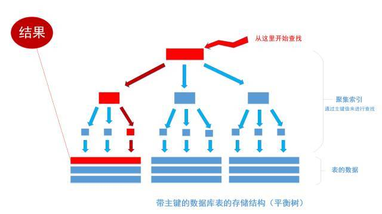

## 深入浅出数据库索引原理

使用索引很简单，只要能写创建表的语句，就肯定能写创建索引的语句，要知道这个世界上是不存在不会创建表的服务器端程序员的。然而， 会使用索引是一回事， 而深入理解索引原理又能恰到好处使用索引又是另一回事，这完全是两个天差地别的境界（我自己也还没有达到这层境界）。很大一部份程序员对索引的了解仅限于到“加索引能使查询变快”这个概念为止。

- 为什么要给表加上主键？
- 为什么加索引后会使查询变快？
- 为什么加索引后会使写入、修改、删除变慢？
- 什么情况下要同时在两个字段上建索引

这些问题他们可能不一定能说出答案。知道这些问题的答案有什么好处呢？如果开发的应用使用的数据库表中只有1万条数据，那么了解与不了解真的没有差别， 然而， 如果开发的应用有几百上千万甚至亿级别的数据，那么不深入了解索引的原理， 写出来程序就根本跑不动，就好比如果给货车装个轿车的引擎，这货车还能拉的动货吗？

接下来就讲解一下上面提出的几个问题，希望对阅读者有帮助。

网上很多讲解索引的文章对索引的描述是这样的「索引就像书的目录， 通过书的目录就准确的定位到了书籍具体的内容」，这句话描述的非常正确， 但就像脱了裤子放屁，说了跟没说一样，通过目录查找书的内容自然是要比一页一页的翻书找来的快，同样使用的索引的人难到会不知道，通过索引定位到数据比直接一条一条的查询来的快，不然他们为什么要建索引。

想要理解索引原理必须清楚一种数据结构「平衡树」(非二叉)，也就是b tree或者 b+ tree，重要的事情说三遍：“平衡树，平衡树，平衡树”。当然， 有的数据库也使用哈希桶作用索引的数据结构 ， 然而， 主流的RDBMS都是把平衡树当做数据表默认的索引数据结构的。

我们平时建表的时候都会为表加上主键， 在某些关系数据库中， 如果建表时不指定主键，数据库会拒绝建表的语句执行。 事实上， 一个加了主键的表，并不能被称之为「表」。一个没加主键的表，它的数据无序的放置在磁盘存储器上，一行一行的排列的很整齐， 跟我认知中的「表」很接近。如果给表上了主键，那么表在磁盘上的存储结构就由整齐排列的结构转变成了树状结构，也就是上面说的「平衡树」结构，换句话说，就是整个表就变成了一个索引。没错， 再说一遍， 整个表变成了一个索引，也就是所谓的「聚集索引」。 这就是为什么一个表只能有一个主键， 一个表只能有一个「聚集索引」，因为主键的作用就是把「表」的数据格式转换成「索引（平衡树）」的格式放置。

其中树的所有结点（底部除外）的数据都是由主键字段中的数据构成，也就是通常我们指定主键的id字段。最下面部分是真正表中的数据。 假如我们执行一个SQL语句：

```sql
select * from table where id = 1256;
```



首先根据索引定位到1256这个值所在的叶结点，然后再通过叶结点取到id等于1256的数据行。 这里不讲解平衡树的运行细节， 但是从上图能看出，树一共有三层， 从根节点至叶节点只需要经过三次查找就能得到结果。

假如一张表有一亿条数据 ，需要查找其中某一条数据，按照常规逻辑， 一条一条的去匹配的话， 最坏的情况下需要匹配一亿次才能得到结果，用大O标记法就是O(n)最坏时间复杂度，这是无法接受的，而且这一亿条数据显然不能一次性读入内存供程序使用， 因此， 这一亿次匹配在不经缓存优化的情况下就是一亿次IO开销，以现在磁盘的IO能力和CPU的运算能力， 有可能需要几个月才能得出结果 。如果把这张表转换成平衡树结构（一棵非常茂盛和节点非常多的树），假设这棵树有10层，那么只需要10次IO开销就能查找到所需要的数据， 速度以指数级别提升，用大O标记法就是O(log n)，n是记录总树，底数是树的分叉数，结果就是树的层次数。

然而， 事物都是有两面的， 索引能让数据库查询数据的速度上升， 而使写入数据的速度下降，原因很简单的， 因为平衡树这个结构必须一直维持在一个正确的状态， 增删改数据都会改变平衡树各节点中的索引数据内容，破坏树结构， 因此，在每次数据改变时， DBMS必须去重新梳理树（索引）的结构以确保它的正确，这会带来不小的性能开销，也就是为什么索引会给查询以外的操作带来副作用的原因。

讲完聚集索引 ， 接下来聊一下非聚集索引， 也就是我们平时经常提起和使用的常规索引。

非聚集索引和聚集索引一样， 同样是采用平衡树作为索引的数据结构。索引树结构中各节点的值来自于表中的索引字段， 假如给user表的name字段加上索引 ， 那么索引就是由name字段中的值构成，在数据改变时， DBMS需要一直维护索引结构的正确性。如果给表中多个字段加上索引 ， 那么就会出现多个独立的索引结构，每个索引（非聚集索引）互相之间不存在关联。 如下图


每次给字段建一个新索引， 字段中的数据就会被复制一份出来， 用于生成索引。 因此， 给表添加索引，会增加表的体积， 占用磁盘存储空间。

非聚集索引和聚集索引的区别在于， 通过聚集索引可以查到需要查找的数据， 而通过非聚集索引可以查到记录对应的主键值 ， 再使用主键的值通过聚集索引查找到需要的数据.

不管以任何方式查询表， 最终都会利用主键通过聚集索引来定位到数据， 聚集索引（主键）是通往真实数据所在的唯一路径。

然而， 有一种例外可以不使用聚集索引就能查询出所需要的数据， 这种非主流的方法 称之为「覆盖索引」查询， 也就是平时所说的复合索引或者多字段索引查询。 文章上面的内容已经指出， 当为字段建立索引以后， 字段中的内容会被同步到索引之中， 如果为一个索引指定两个字段， 那么这个两个字段的内容都会被同步至索引之中。

